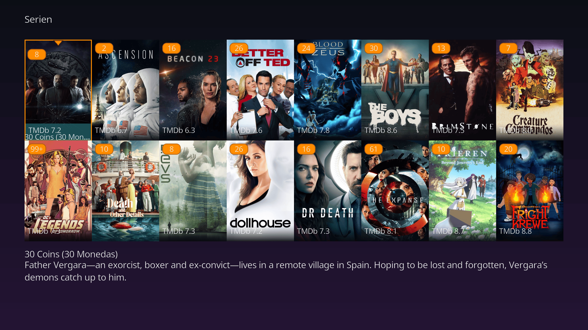
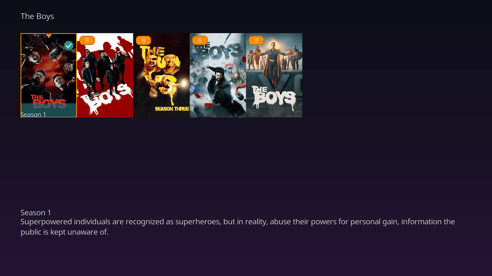
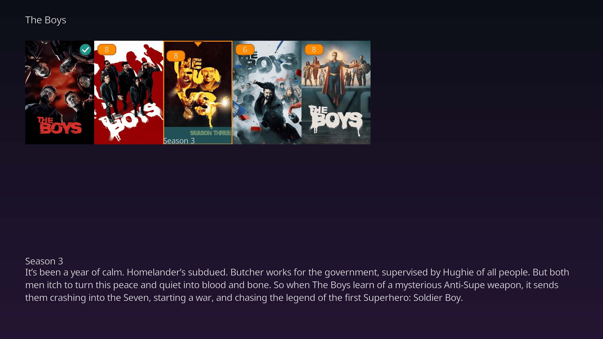
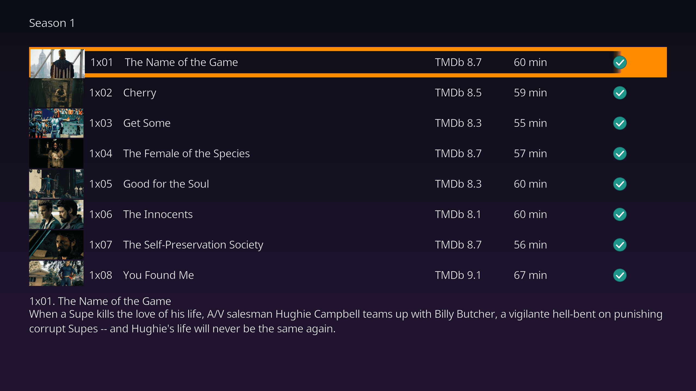

# jellyfin-kodi-plex

*[Deutsche Version](README.de.md)*

A Kodi program addon (`script.jellyfin.plex`) that connects to a Jellyfin media server and
presents a custom, hub-based interface modelled on the Plex Web/App experience — rather than
Kodi's default skin listings.

Architecture is modelled on the open-source [Plex for Kodi](https://github.com/plexinc/plex-for-kodi)
addon: a Kodi *script* addon (not `plugin.video.*`) that opens its own `WindowXML`/`WindowXMLDialog`
windows to fully control the UI, independent of the active Kodi skin.

## Screenshots


The Home screen's hub rows: a watched checkmark badge on already-seen movies, and an
unwatched-episode-count badge (capped at "99+") on TV shows with episodes left to watch.



Browsing the TV library: the synopsis pane below the grid tracks whichever poster has focus.




The same synopsis pane one level deeper, browsing a series' seasons — it updates instantly as
focus moves between seasons.



A season's episodes get an `ls -l`-style detail list instead of a poster grid: episode code,
title, rating, duration, and watched state in aligned columns, plus the same synopsis pane below.

## Installation

### Install via repository (recommended — enables auto-updates)

1. Download the repository addon zip:
   [`repository.jellyfinplex-1.0.0.zip`](https://drachenhort.github.io/jellyfin-kodi-plex/repository.jellyfinplex/repository.jellyfinplex-1.0.0.zip)
2. In Kodi: **Add-ons → Install from zip file**, select the downloaded file.
3. Then **Add-ons → Install from repository → Jellyfin (Plex-style) Repository →
   Video add-ons → Jellyfin (Plex-style)**, and install it from there.

From then on, Kodi checks this repository for new versions and can auto-update the addon like
any other, so you no longer need to manually reinstall a zip after every release.

### Install from a plain zip (no auto-updates)

Download the addon zip from a [GitHub Release](https://github.com/drachenhort/jellyfin-kodi-plex/releases)
and use **Add-ons → Install from zip file** in Kodi. You'll need to repeat this manually for every
future version.

## Status

Milestone 1 (in progress): login (LAN autodiscovery, Quick Connect + password fallback) → home screen with
Continue Watching / Next Up / Recently Added Movies / Recently Added TV / Recently Added Music hub
rows → library poster-wall browsing, including drill-down through TV (Series → Season → Episode)
and Music (Artist → Album → Track) hierarchies, and a Search screen → item detail page → playback
(video and audio, using Kodi's own native OSD/controls) with progress reported back to the server,
and a Servers screen for saving logins to multiple Jellyfin servers and switching between them. An
album's own screen adds Play All/Shuffle buttons to queue its tracks back-to-back, advancing to the
next track only when the current one finishes naturally rather than being stopped early.

The TV/Music drill-down works by fetching each item's direct children non-recursively
(`lib/windows/browse.py` is reused at every level: a library's top-level items, a series'
seasons, a season's episodes, an artist's albums, an album's tracks) and branching on the
clicked item's type (`lib/main.py`'s `CONTAINER_TYPES`) to decide whether to browse deeper or
open the detail/play screen. Music artist grouping relies on the library being organized as one
folder per artist — Jellyfin's virtual cross-folder artist aggregation (`/Artists`) isn't used.
The browse screen also shows a synopsis pane for whichever item currently has focus (most useful
browsing a series' seasons), and marks already-watched movies/episodes with a checkmark badge and
partially-watched shows with an unwatched-episode-count badge.

The login screen autodetects Jellyfin servers on the LAN (`lib/jellyfin/discovery.py`) using the
UDP broadcast protocol inherited from Emby/MediaBrowser — found servers are offered as a pick-list
that fills in the server URL field, with manual entry still available as a fallback.

Multi-server support (`lib/servers.py`) stores saved logins as a list of `{name, server_url,
access_token, user_id}` dicts, serialized into a single hidden addon setting rather than one
setting per field — `lib/main.py` owns reading/writing that setting and matches re-logins to an
already-saved server URL to update its entry in place instead of duplicating it. The Servers
button on Home (`lib/windows/servers.py`) opens a picker to switch the active server, add another
via the same login flow, or remove a saved one (the currently active server can't be removed —
switch away from it first). An existing single-server install is migrated into this list
automatically the first time it runs after updating, so it doesn't get logged out.

## Development

```bash
pip install -r requirements-dev.txt   # pytest
pytest
```

`lib/jellyfin/*` is a pure-Python Jellyfin API client with no `xbmc*` imports, so it's testable
directly with pytest. `lib/windows/*` and `lib/player.py` are the only modules that touch
`xbmcgui`/`xbmc`; `tests/kodi_stubs/` provides minimal stand-ins for those modules (registered into
`sys.modules` by `tests/conftest.py`), so this layer runs under plain pytest too — no real Kodi
environment needed to exercise it.

To try it in Kodi: copy or symlink this directory into
`~/.kodi/addons/script.jellyfin.plex/` and launch it from the Programs menu.
